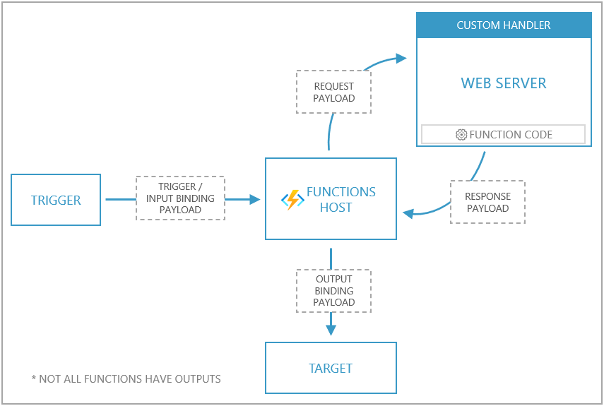

# 1. Develop Azure compute solutions (25-30%)
## 1.1 Implement IaaS solutions
### provision virtual machines (VMs)
- create VM
    1. navigate Azure Portal -> Create a Resource (+) -> Compute
        - pick OS image
    2. "Create a virtual machine" wizard
        - Subscription
        - Resource group
            - alternative script: create ResourceGroup
                ```ps
                New-AzResourceGroup -Name "myResourceGroup" -Location "EastUS"
                ```
        - VM name, Region, Image
        - Size (CPUs, RAM, Disks)
        - Administrator account (username, password)
        - Public inbound ports: allow selected ports (HTTP, HTTPS, SSH, RDP)
        - "Review & Create" > "Create"
            - alternative script: create VM
                ```ps
                $cred = Get-Credential 

                New-AzVM -Name MyVm -Credential $cred -ResourceGroupName MyResourceGroup -Image win2016datacenter -Size Standard_D2S_V3
                ```
- encrypt *.VHD disk using BitLocker ([docs](https://docs.microsoft.com/en-us/azure/virtual-machines/windows/disk-encryption-powershell-quickstart))
    1. create Azure KeyVault configured for encryption keys in same region of VM
        - script: 
            ```ps
            New-AzKeyvault -name MyKV -ResourceGroupName myResourceGroup -Location EastUS -EnabledForDiskEncryption
            ```
    2. encrypt in Azure Cloud Shell: `Set-AzVMDiskEncryptionExtension`
        - script: 
            ```ps
            $KeyVault = Get-AzKeyVault -VaultName MyKV -ResourceGroupName MyResourceGroup

            Set-AzVMDiskEncryptionExtension -ResourceGroupName MyResourceGroup -VMName MyVM -DiskEncryptionKeyVaultUrl $KeyVault.VaultUri -DiskEncryptionKeyVaultId $KeyVault.ResourceId
            ```
### configure, validate, and deploy ARM templates
- configure ARM template
    1. "Create a virtual machine" wizard 
    2. "Download a template for automation"
        - Template screen: 
            - template (JSON file): 
                - parameters: virtualMachineName, osDiskType, adminUsername, adminPassword, ...       
                    - usage: `"[parameters('virtualMachineName')]"`
                - variables
                - resources
        - Parameters screen: 
            - parameter definitions (JSON file)
                ```
                "parameters": {
                    "virtualMachineName": {
                        "value": "myVM"
                    }
                }
                ```
        - PowerShell screen:
            - script to execute template + parameters files
    3. "Download"
        - modify on local machine
    4. "Add to library"
        - stored in Azure
- PowerShell: Download the template from a specified resource group using PowerShell
    ```ps
    Export-AzResourceGroup -ResourceGroupName "myResourceGroup" -Path "C:\users\public\downloads"
    ```

### configure container images for solutions
- docker: [docs](https://docs.docker.com/engine/reference/builder/)
    - Dockerfile
- docker-compose

### publish an image to the Azure Container Registry
1. create ACR
    - navigate Azure Portal -> Create a Resource (+) -> Containers
        - pick Container registry
2. login to ACR using Azure CLI: `az acr login`
3. Dockerfile -> build -> tag -> push image to Azure Container Registry
4. check image in repository: Azure Portal -> Container registry -> Repositories

### run containers by using Azure Container Instance
1. create ACI
    - navigate Azure Portal -> Azure Cloud Shell: Bash
        - Create rg: `az group create --name learn-deploy-aci-rg --location eastus`
    - example: create container with environment variables (db connection credentials ) and mounted volume (Azure file share)
        ```bash
        az container create \
            --resource-group learn-deploy-aci-rg \
            --name mycontainer \
            --image microsoft/aci-helloworld \
            --ports 80 \
            --dns-name-label $DNS_NAME_LABEL \
            --location eastus
            --environment-variables \
                COSMOS_DB_ENDPOINT=$COSMOS_DB_ENDPOINT \
                COSMOS_DB_MASTERKEY=$COSMOS_DB_MASTERKEY
            --azure-file-volume-account-name $STORAGE_ACCOUNT_NAME \
            --azure-file-volume-account-key $STORAGE_KEY \
            --azure-file-volume-share-name aci-share-demo \
            --azure-file-volume-mount-path /aci/logs/
        ```
2. Check status
    ```bash
    az container show \
        --resource-group learn-deploy-aci-rg \
        --name mycontainer \
        --query "{FQDN:ipAddress.fqdn,ProvisioningState:provisioningState}" \
        --output table
    ```
3. Check logs
    ```bash
    az container logs \
        --resource-group learn-deploy-aci-rg \
        --name mycontainer-restart-demo
    ```
4. Attach to container (receive events)
    ```bash
    az container attach \
        --resource-group learn-deploy-aci-rg \
        --name mycontainer
    ```
5. Monitor container (CPUUsage, MemoryUsage)
    ```bash
    az monitor metrics list \
        --resource $CONTAINER_ID \
        --metrics CPUUsage \
        --output table
    ```

## 1.2 Create Azure App Service Web Apps
### create an Azure App Service Web App
- create App Service
    - Azure Portal > Create new Resource > Web > Web App
    - create new **App Service Plan**, select location
        - Free: 10 apps, 1GB storage
        - Shared: 100 apps, 1GB storage
        - Basic: unlimited apps, 10GB storage, environments for **dev/test** (up to 3)
        - Standard: unlimited apps, 50GB storage, environments for **production workloads** (up to 10)
        - Premium: unlimited apps, 250GB storage, environments for enhanced performance/scale (up to 20)
        - Isolated: unlimited apps, 1TB storage, environments for enhanced performance/scale + **security/isolation** (up to 100)   
- WebJobs: run background scripts in Azure
    - triggers:
        - scheduled: CRON expression
        - manual: webhooks

### enable diagnostics logging
- navigate: App Service -> Monitoring -> Diagnostic logs
    - enable Application Logging (**Blob**), Web server Logging, ...
        - pick level (Error, Verbose, ...)
        - create **storage account**, select it
        - set retention period (days)
        - check logs in storage account container
    - enable Application Logging (**Filesystem**)
        - pick level (Error, Verbose, ...)
        - check logs in App Service -> Monitoring -> **Log stream**

### deploy code to a web app
1. build app
2. deploy web app using Azure Pipelines
    - Web Deploy package (ASP.NET)
        - `azure-pipelines.yml` task:
            ```yml
              - task: AzureWebApp@1
                inputs:
                    azureSubscription: '<Azure service connection>'
                    appName: '<Name of web app>'
                    package: $(System.DefaultWorkingDirectory)/**/*.zip
                    slotName: staging
            ```
        - locally: Visual Studio > Solution Explorer -> Publish -> Target: Azure -> App Service -> Sign in
            - select resource group + App Service instance
    - Alternative: Push from Git
        - `git remote add azure <deploymentLocalGitUrl-from-create-step>`
        - `git push azure master`

### configure web app settings including SSL, API settings, and connection strings
- navigate App Service -> Settings
    - Application Settings > Connection strings
    - SSL settings
    - Authentication/Authorization
### implement autoscaling rules including scheduled autoscaling and autoscaling by operational or system metrics
- navigate App Service > Scale up/out (App Service Plan)

## 1.3 Implement Azure functions
### create and deploy Azure Functions apps
- create Azure Functions app (C#)
    - enable extension: Visual Studio > Extensions and Updates -> Tools -> **Azure Functions and Web Job Tools**
    - create project: Visual Studio > File > New Project > Azure Functions template > Next > enter Project name > Create
        - .NET version:
            - Azure Functions 3.x runtime supports .NET Core 3.x
            - Azure Functions 1.x runtime supports .NET Framework
        - Function template: HTTP trigger = function triggered by HTTP request
        - Storage account: Storage account connection string / local Storage emulator
        - Authorization level: Anonymous = can be triggered by any client without providing a key
    - explore project
        - `Microsoft.NET.Sdk.Functions` NuGet package will be installed in new C# project
        - `host.json`: configure Functions host (local or Azure)
        - `local.settings.json`: settings used when running functions locally
    - configure build output settings
        - explicitly include assemblies of dependencies using `FunctionsPreservedDependencies` in `.csproj` file
    - add function to project
        - Solution Explorer > Add > New item > Azure Function > enter Name > Add > OK
            - entry point of code: static `Run()` method
                ```c#
                using System;
                using Microsoft.Azure.WebJobs;
                using Microsoft.Azure.WebJobs.Host;
                using Microsoft.Extensions.Logging;

                namespace FunctionApp1
                {
                    public static class Function1
                    {
                        [FunctionName("QueueTriggerCSharp")]
                        public static void Run([QueueTrigger("myqueue-items", 
                            Connection = "QueueStorage")]string myQueueItem, ILogger log)
                        {
                            log.LogInformation($"C# Queue trigger function processed: {myQueueItem}");
                        }
                    }
                }
                ```
- deploy Azure Function app
    - Visual Studio
        - Solution Explorer -> Publish -> Target: Azure -> Azure Function App (Windows)
            - Function Instance: Create a new Azure Function
            - Choose: Name, Subscription, Resource group, Plan type, Location, Azure storage
            - Select "Run from package file"
                - Function app is deployed using "Zip Deploy" with "Run-From-Package"
        - Select Finish -> Publish -> Manage in Cloud Explorer: manage (start/stop) function apps in Azure from Visual Studio
    - Azure Pipelines: `azure-pipelines.yml` task:
        ```yml
        trigger:
        - main

        variables:
        # Azure service connection established during pipeline creation
        azureSubscription: <Name of your Azure subscription>
        appName: <Name of the Function app>
        # Agent VM image name
        vmImageName: 'ubuntu-latest'

        - task: AzureFunctionApp@1 # Add this at the end of your file
          inputs:
            azureSubscription: <Azure service connection>
            appType: functionAppLinux
            appName: $(appName)
            package: $(System.ArtifactsDirectory)/**/*.zip
            deployToSlotOrASE: true
            resourceGroupName: <Name of the resource group>
            slotName: staging
        ```

### implement input and output bindings for a function
1. configure project for local development
2. add appropriate NuGet extension package for specific binding
    - example: C# class library > Event Hubs trigger
3. add binding settings to the `Values` collection in [local setting file](https://docs.microsoft.com/en-us/azure/azure-functions/functions-run-local?tabs=windows%2Ccsharp%2Cbash#local-settings-file)
4. add appropriate binding attribute to the method signature
    - example: 
        - input binding/function trigger = queue message
        - output binding = create new queue message in different queue
            ```c#
            public static class SimpleExampleWithOutput
            {
                [FunctionName("CopyQueueMessage")]
                public static void Run(
                    [QueueTrigger("myqueue-items-source", Connection = "AzureWebJobsStorage")] string myQueueItem, 
                    [Queue("myqueue-items-destination", Connection = "AzureWebJobsStorage")] out string myQueueItemCopy,
                    ILogger log)
                {
                    log.LogInformation($"CopyQueueMessage function processed: {myQueueItem}");
                    myQueueItemCopy = myQueueItem;
                }
            }
            ```

### implement function triggers by using data operations, timers, and webhooks
- [Data operations (in/out)](https://docs.microsoft.com/en-us/azure/azure-functions/functions-bindings-storage-blob-trigger?tabs=csharp)
    ```c#
    [FunctionName("ResizeImage")]
    public static void Run(
        [BlobTrigger("sample-images/{name}", Connection = "StorageConnectionAppSetting")] Stream image,
        [Blob("sample-images-md/{name}", FileAccess.Write)] Stream imageSmall)
    {
        ....
    }
    ```
- [Timer (in)](https://docs.microsoft.com/en-us/azure/azure-functions/functions-bindings-timer?tabs=csharp)
    ```c#
    [FunctionName("TimerTriggerCSharp")]
    public static void Run([TimerTrigger("0 */5 * * * *")]TimerInfo myTimer, ILogger log)
    {
        if (myTimer.IsPastDue)
        {
            log.LogInformation("Timer is running late!");
        }
        log.LogInformation($"C# Timer trigger function executed at: {DateTime.Now}");
    }
    ```
- [HTTP & webhooks (in/out)](https://docs.microsoft.com/en-us/azure/azure-functions/functions-bindings-http-webhook-trigger?tabs=csharp)
    - Trigger on HTTP request + return HTTP response
        ```c#
        [FunctionName("HttpTriggerCSharp")]
        public static async Task<IActionResult> Run(
            [HttpTrigger(AuthorizationLevel.Function, "get", "post", Route = null)]
            HttpRequest req, ILogger log)
        {
            log.LogInformation("C# HTTP trigger function processed a request.");

            string name = req.Query["name"];
            
            string requestBody = String.Empty;
            using (StreamReader streamReader =  new  StreamReader(req.Body))
            {
                requestBody = await streamReader.ReadToEndAsync();
            }
            dynamic data = JsonConvert.DeserializeObject(requestBody);
            name = name ?? data?.name;
            
            return name != null
                ? (ActionResult)new OkObjectResult($"Hello, {name}")
                : new BadRequestObjectResult("Please pass a name on the query string or in the request body");
        }
        ```

### implement Azure Durable Functions
- extension of Azure Functions: write stateful functions in serverless compute environment
    - **orchestrator functions**: manages state, checkpoints, restarts
    - entity functions = stateful entities

#### Design patterns
- **Function chaining**: sequence of functions that execute in a specific order, output of one function is applied to the input of another function
    - 
    - imperative coding construct (top-down execution):
        ```csharp
        [FunctionName("Chaining")]
        public static async Task<object> Run(
            [OrchestrationTrigger] IDurableOrchestrationContext context)
        {
            try
            {
                var x = await context.CallActivityAsync<object>("F1", null);
                var y = await context.CallActivityAsync<object>("F2", x);
                var z = await context.CallActivityAsync<object>("F3", y);
                return  await context.CallActivityAsync<object>("F4", z);
            }
            catch (Exception)
            {
                // Error handling or compensation goes here.
            }
        }
        ```
- **Fan out/fan in**: execute multiple functions in parallel, wait for all functions to finish
    - normal app: 
        - fan out = send multiple messages to a queue
        - fanning back in = write code to track when the queue-triggerd functions end, and store function outputs
            - this is handled by Durable Functions extensions
    - 
    - fan back in after execution:
        ```csharp
        [FunctionName("FanOutFanIn")]
        public static async Task Run(
            [OrchestrationTrigger] IDurableOrchestrationContext context)
        {
            var parallelTasks = new List<Task<int>>();

            // Get a list of N work items to process in parallel.
            object[] workBatch = await context.CallActivityAsync<object[]>("F1", null);
            for (int i = 0; i < workBatch.Length; i++)
            {
                Task<int> task = context.CallActivityAsync<int>("F2", workBatch[i]);
                parallelTasks.Add(task);
            }

            await Task.WhenAll(parallelTasks);

            // Aggregate all N outputs and send the result to F3.
            int sum = parallelTasks.Sum(t => t.Result);
            await context.CallActivityAsync("F3", sum);
        }
        ```
- **Async HTTP APIs**: coordinate the state of long-running operations with external clients
    - normal app: 
        -  HTTP endpoint triggers long-running action + redirect client to status endpoint that **polls** to check if the operation is finished
            - Durable Functions: exposes built-in webhook HTTP API to query the function status
    - 
- **Monitor**: flexible, recurring process in a workflow, with polling until specific condition is met
    - example use-case: cleanup job on static interval
        - problem: managing instance lifetime becomes complex
    - 
    - implementation of multiple monitors that observe arbitrary endpoints:
        ```csharp
        [FunctionName("MonitorJobStatus")]
        public static async Task Run(
            [OrchestrationTrigger] IDurableOrchestrationContext context)
        {
            int jobId = context.GetInput<int>();
            int pollingInterval = GetPollingInterval();
            DateTime expiryTime = GetExpiryTime();

            while (context.CurrentUtcDateTime < expiryTime)
            {
                var jobStatus = await context.CallActivityAsync<string>("GetJobStatus", jobId);
                if (jobStatus == "Completed")
                {
                    // Perform an action when a condition is met.
                    await context.CallActivityAsync("SendAlert", machineId);
                    break;
                }

                // Orchestration sleeps until this time.
                var nextCheck = context.CurrentUtcDateTime.AddSeconds(pollingInterval);
                await context.CreateTimer(nextCheck, CancellationToken.None);
            }

            // Perform more work here, or let the orchestration end.
        }
        ```
- **Human interaction**: involves some kind of human interaction in an automated process
    - uses timeouts and compensation logic
    - 
    - implementation using orchestrator function using a **durable timer**:
        - orchestrator waits for external event (notification) generated by a human interaction
        ```csharp
        [FunctionName("ApprovalWorkflow")]
        public static async Task Run(
            [OrchestrationTrigger] IDurableOrchestrationContext context)
        {
            await context.CallActivityAsync("RequestApproval", null);
            using (var timeoutCts = new CancellationTokenSource())
            {
                DateTime dueTime = context.CurrentUtcDateTime.AddHours(72);
                Task durableTimeout = context.CreateTimer(dueTime, timeoutCts.Token);

                Task<bool> approvalEvent = context.WaitForExternalEvent<bool>("ApprovalEvent");
                if (approvalEvent == await Task.WhenAny(approvalEvent, durableTimeout))
                {
                    timeoutCts.Cancel();
                    await context.CallActivityAsync("ProcessApproval", approvalEvent.Result);
                }
                else
                {
                    await context.CallActivityAsync("Escalate", null);
                }
            }
        }
        ```
        - raise event using another function in the same Function App:
        ```csharp
        [FunctionName("RaiseEventToOrchestration")]
        public static async Task Run(
            [HttpTrigger] string instanceId,
            [DurableClient] IDurableOrchestrationClient client)
        {
            bool isApproved = true;
            await client.RaiseEventAsync(instanceId, "ApprovalEvent", isApproved);
        }
        ```
- **Aggregator** (stateful entities): aggregate event data over a period of time into a single, addressable entity
    - data may come from multiple sources, may be delivered in batches/scattered over long-periods of time
        - aggregator takes action on event data as it arrives, external clients may need to query aggregated data
        - problem: concurrency control becomes a challenge (multiple threads modifying same data at same time, different VMs possible)
            - **Durable entities** solves this
    - 
    - Durable entities: can be modeled in .NET classes
        - example: `Counter` entity
    ```csharp
    public class Counter
    {
        [JsonProperty("value")]
        public int CurrentValue { get; set; }

        public void Add(int amount) => this.CurrentValue += amount;

        public void Reset() => this.CurrentValue = 0;

        public int Get() => this.CurrentValue;

        [FunctionName(nameof(Counter))]
        public static Task Run([EntityTrigger] IDurableEntityContext ctx)
            => ctx.DispatchAsync<Counter>();
    }
    ```

### implement custom handlers
- custom handlers: lightweight web servers that receive events from the Functions host
- used to implement function app in unsupported language/runtime


