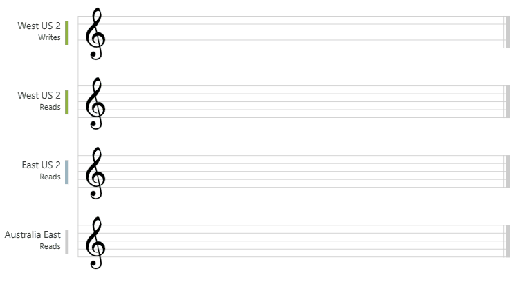

# 2. Develop for Azure storage (15-20%)
## 2.1 Develop solutions that use Cosmos DB storage
### select the appropriate API and SDK for a solution
- Azure Cosmos DB
    - data is stored in atom-record-sequence (ARS) format
    - data is abstracted/projected as an API that is specified when creating the database
- Choices
    - Consistency levels
        - strong, bounded staleness, session, consistent prefix, eventual
    - Multi-model
        - document, key-value, wide-column, graph-based
    - Data access and data manipulation
        - use your own industry standard APIs
        - Azure Cosmos DB account APIs
            - **Core (SQL)**
                - traditional NoSQL document store: query hierarchical JSON documents with SQL-like language
                    - e.g.: `SELECT, FROM, WHERE, ...`
                - uses JavaScript's type system, expression evaluation and function invocation
            - **MongoDB**
                - supports MongoDB wire protocol: allows existing MongoDB client SDKs, drivers and tools to interact with the data
                - JSON document format queries:
                    - e.g.: `db.Items.find({},{productName:1,_id:0})`
            - **Cassandra**
                - possible to query data by using Cassandra Query Language (CQL), data appears in partitioned row store
                    - e.g.: 
                        - `CREATE KEYSPACE, CREATE TABLE, ALTER TABLE, USE, INSERT, SELECT, UPDATE, DELETE...`
                        - `CREATE TABLE Catalog.Items(id text, productName text, description text, supplier text, quantity int, unitCost float, retailPrice float, categories map<text,text>, primary key (id));`
                        - `SELECT id, productName FROM catalog.items`
            - **Azure Table**
                - supports applications that are written for Azure Table Storage that needs premium capabilities (global distribution, high availability, scalable throughput)
                    - often used for IoT data
                - allows for indexing on the Partition and Row keys, no secondary indexes exist
                - automatically indexes all the properties, requires no index management
                - querying is accomplished by using OData and LINQ queries in code + original REST API for GET operations
                    - e.g.: `SELECT i.productName FROM Items i`
            - **Gremlin (graph)**
                - provides graph-based view over the data
                    - vertex: individual item in database
                    - edge: relationship between items in database
                - traversal query language: Apache Tinkerpop - Gremlin
                    - e.g.: 
                    ```js
                    # add 3 vertices (products)
                    g.addV('product').property('productName', 'Industrial Saw').property('description', 'Cuts through anything').property('quantity', 261)
                    g.addV('product').property('productName', 'Belt Sander').property('description', 'Smoothes rough edges').property('quantity', 312)
                    g.addV('product').property('productName', 'Cordless Drill').property('description', 'Bores holes').property('quantity', 647)

                    # add 2 edges (product relationships)
                    g.V().hasLabel('product').has('productName', 'Industrial Saw').addE('boughtWith').to(g.V().hasLabel('product').has('productName', 'Belt Sander'))
                    g.V().hasLabel('product').has('productName', 'Industrial Saw').addE('boughtWith').to(g.V().hasLabel('product').has('productName', 'Cordless Drill'))

                    # query products
                    g.V().hasLabel('product').has('productName', 'Industrial Saw').outE('boughtWith')
                    ```
                - returned results are in GraphSON format
                    - e.g.:
                    ```json
                    {
                        "id": "6c69fba7-2f76-421f-a24e-92d4b8295d67",
                        "label": "boughtWith",
                        "type": "edge",
                        "inVLabel": "product",
                        "outVLabel": "product",
                        "inV": "faaf0997-f5d8-4d01-a527-ae29534ac234",
                        "outV": "a9b13b8f-258f-4148-99c0-f71b30918146"
                    }
                    ```
- Decision Flow


### implement partitioning schemes and partition keys
- partitioning schemes: scale individual containers in a database to meet the performance needs of your application
    - **logical partitions**: items in a container are divided into distinct subsets
        - based on the value of a **partition key**: associated with each item in a container, all items in a logical partition have the same partition key value
            - **item index = item ID + partition key**
            - choosing the right partition key is important for performance
        - defines the scope of database transactions
        - update items using a **transaction with snapshot isolation**
    - **physical partitions**: container is scaled by distributing data and throughput across physical partitions
        - internally, on or more logical partitions are mapped to a single physical partition
        - containers have many logical partitions, but only require a single physical partition
        - see container's physical partition in Azure Portal -> Storage -> Metrics blade
- choosing a partition key: requirements
    - should be **immutable property**
    - have a **high cardinality**
    - request unit (RU) consumption and data storage should be **spread evenly** across all logical partitions
    - for large read-heavy containers: choose partition key that appears frequently as a filter in your queries -> reduces cross-partition queries
    - for small read/write-heavy containers: use item ID as partition key
### perform operations on data and Cosmos DB containers
- Data Explorer: Azure Portal -> Databases -> Azure Cosmos DB -> select database -> Data Explorer
    - Add new items
    - Query/filter data using:
        - SQL queries
        - Geospatial queries (GeoJSON points - coordinates)
- stored procedures
    - perform complex transactions on documents and properties
    - written in JavaScript, stored in container on Azure Cosmos DB
    - improves performance over client-side programming
    - only way to achieve atomic transactions within Azure Cosmos DB
        - client-side SDKs do not support transactions
    - e.g.:
        ```js
        function helloWorld() {
            var context = getContext();
            var response = context.getResponse();

            response.setBody("Hello, World");
        }
        ```
- user-defined functions (UDF)
    - extend Azure Cosmos DB SQL query language grammar
    - implement custom business login, such as calculation on properties/documents
    - can only be called from inside queries (unlike stored procedures), they do not have access to the context object
    - e.g.:
        ```js
        function producttax(price) {
            if (price == undefined) 
                throw 'no input';

            var amount = parseFloat(price);

            if (amount < 1000) 
                return amount * 0.1;
            else if (amount < 10000) 
                return amount * 0.2;
            else
                return amount * 0.4;
        }
        ```

### set the appropriate consistency level for operations
- Consistency levels:
    
    - Strong consistency
        - **linearizability guarantee**: reads are guaranteed to return most recent committed version of an item, client never sees uncommitted or partial write
        - 
    - Bounded staleness:
        - **consistent-prefix guarantee**: reads might lag behind writes by "K" versions or by "T" time interval
            - staleness can be configured in 2 ways:
                - number of versions (K) of the item - 100 items
                - time interval (T) reads might lag behind writes - 5 seconds
        - 
    - Session
        - within a single client session reads are guaranteed to honor the:
            - **consistent-prefix guarantees**
            - **monotonic reads/writes guarantees**
            - **read-your-writes guarantees**
            - **write-follows-reads guarantees**
        - assumes a single "writer" session or sharing the session token for multiple writers
        - 
    - Consistent prefix
        - updates that are returned contain some prefix of all the updates, with no gaps
        - 
    - Eventual
        - no ordering guarantee for reads
        - in absence of further writes, the replicas eventually converge
        - 

### manage change feed notifications
- persistent record of changes to a container in the order they occur
    - works by listening to an Azure Cosmos container for any changes
    - outputs the sorted list of documents that were changed in the order in which they were modified
    - persisted changes can be processed asynchronously and incrementally
    - output can be distributed across on or more consumers for parallel processing
- working with change feed
    1. with **Azure Functions**: create small reactive Azure Functions that will automatically be triggered on each new event in change feed
        
    2. with **change feed processor**: simplifies the process of reading the change feed and distribute the event processing across multiple consumers effectively
        - components: 
            - **monitored container**: has the data from which the change feed is generated
            - **lease container**: acts as a state storage and coordinates processing across multiple workers
            - **host**: application instance that uses the change feed processor to listen for changes, multiple instances with the same lease configuration can run in parallel
            - **delegate**: code that defines what you want to do with each batch of changes that the change feed processor reads
        - 
        - implementation:
            - from monitored container `Container` (= code entrypoint), call `GetChangeFeedProcessorBuilder`
            - e.g.:
            ```csharp
            /// <summary>
            /// Start the Change Feed Processor to listen for changes and process them with the HandleChangesAsync implementation.
            /// </summary>
            private static async Task<ChangeFeedProcessor> StartChangeFeedProcessorAsync(
                CosmosClient cosmosClient,
                IConfiguration configuration)
            {
                string databaseName = configuration["SourceDatabaseName"];
                string sourceContainerName = configuration["SourceContainerName"];
                string leaseContainerName = configuration["LeasesContainerName"];

                Container leaseContainer = cosmosClient.GetContainer(databaseName, leaseContainerName);
                ChangeFeedProcessor changeFeedProcessor = cosmosClient.GetContainer(databaseName, sourceContainerName)
                    .GetChangeFeedProcessorBuilder<ToDoItem>(processorName: "changeFeedSample", onChangesDelegate: HandleChangesAsync)
                        .WithInstanceName("consoleHost")
                        .WithLeaseContainer(leaseContainer)
                        .Build();

                Console.WriteLine("Starting Change Feed Processor...");
                await changeFeedProcessor.StartAsync();
                Console.WriteLine("Change Feed Processor started.");
                return changeFeedProcessor;
            }
            ```

## 2.2 Develop solutions that use blob storage
### move items in Blob storage between storage accounts or containers
- synchronous and asynchronous methods for transferring blobs
- move blobs between Azure storage accounts using:
    - .NET Storage Client library
        - collection of objects/methods that you can use to build custom applications that manipulate items held in Azure Storage
        - construct your own applications to upload/download/migrate blobs between storage accounts
        - incorporate your code into existing applications, deploy code to variety of environments (e.g.: Azure Functions)
        ```csharp
        using Microsoft.WindowsAzure.Storage;
        using Microsoft.WindowsAzure.Storage.Blob;

        // The variable sourceConnection is a string holding the connection string for the storage account
        CloudStorageAccount sourceAccount = CloudStorageAccount.Parse(sourceConnection);
        CloudBlobClient sourceClient = sourceAccount.CreateCloudBlobClient();

        // Download a blob
        CloudBlobContainer sourceBlobContainer = sourceClient.GetContainerReference(sourceContainer);
        ICloudBlob sourceBlob = await sourceBlobContainer.GetBlobReferenceFromServerAsync("MyBlob.doc");
        Console.WriteLine($"Last modified: {sourceBlob.Properties.LastModified}");
        await sourceBlob.DownloadToFileAsync("MyFile.doc", System.IO.FileMode.Create);

        // Upload a blob
        CloudBlobContainer destBlobContainer = destClient.GetContainerReference(destContainer);
        CloudBlockBlob destBlob = destBlobContainer.GetBlockBlobReference("NewBlob.doc");
        await destBlob.UploadFromFileAsync("MyFile.doc");

        // Delete a blob
        bool blobExisted = await sourceBlob.DeleteIfExistsAsync();

        // Iterate blobs in a container
        BlobContinuationToken token = null;

        do
        {
            BlobResultSegment segment = await blobContainer.ListBlobsSegmentedAsync(prefix: "", currentToken: token);
            foreach (CloudBlockBlob blobItem in segment.Results)
            {
                // Process the current blob
                ICloudBlob blob = await blobContainer.GetBlobReferenceFromServerAsync(blobItem.Name);
                ...
            }
        } while (token != null);
        ```
        ```csharp
        // Copy blob between storage accounts
        CloudBlockBlob destBlob = destContainer.GetBlockBlobReference(sourceBlob.Name);
        await destBlob.StartCopyAsync(new Uri(GetSharedAccessUri(sourceBlob.Name, sourceContainer)));

        // Create a SAS token for the source blob, to enable it to be read by the StartCopyAsync method
        private static string GetSharedAccessUri(string blobName, CloudBlobContainer container)
        {
            DateTime toDateTime = DateTime.Now.AddMinutes(60);

            SharedAccessBlobPolicy policy = new SharedAccessBlobPolicy
            {
                Permissions = SharedAccessBlobPermissions.Read,
                SharedAccessStartTime = null,
                SharedAccessExpiryTime = new DateTimeOffset(toDateTime)
            };

            CloudBlockBlob blob = container.GetBlockBlobReference(blobName);
            string sas = blob.GetSharedAccessSignature(policy);

            return blob.Uri.AbsoluteUri + sas;
        }
        ```
    - Azure CLI: `az storage`
        - upload/download blobs between blob storage/local file system
            - `az storage blob copy`
            ```bash
            az storage blob upload-batch \
                --destination specifications \
                --pattern "*.md" \
                --source ~/sample/specifications \
                --account-name $HOT_STORAGE_NAME \
                --account-key $HOT_KEY
            ```
        - runs asynchronously
        - uses Azure Storage service to manage the copy process
    - AzCopy tool
        - transfer data in/out/between Azure storage accounts
            - upload data: `azcopy copy "myfile.txt" "https://myaccount.blob.core.windows.net/mycontainer/"`
            - download data: `azcopy copy "https://myaccount.blob.core.windows.net/mycontainer/myblob?<sas token>" "myblobdata"`
            - between storage acounts: `azcopy copy "https://sourceaccount.blob.core.windows.net/sourcecontainer/*?<source sas token>" "https://destaccount.blob.core.windows.net/destcontainer/*?<dest sas token>"`
        - supports hierarchical containers
        - supports selection by pattern matching

### set and retrieve properties and metadata
- Set/retrieve system properties: **Azure Storage client library for .NET**
    - exist on each Blob storage resource, some correspond to certain standard HTTP headers
    - e.g.: set `ContentType` adn `ContentLanguage` system properties using the `SetHttpHeaders` or `SetHttpHeadersAsync` calls
    ```csharp
    public static async Task SetBlobPropertiesAsync(BlobClient blob)
    {
        Console.WriteLine("Setting blob properties...");

        try
        {
            // Get the existing properties
            BlobProperties properties = await blob.GetPropertiesAsync();

            BlobHttpHeaders headers = new BlobHttpHeaders
            {
                // Set the MIME ContentType every time the properties 
                // are updated or the field will be cleared
                ContentType = "text/plain",
                ContentLanguage = "en-us",

                // Populate remaining headers with 
                // the pre-existing properties
                CacheControl = properties.CacheControl,
                ContentDisposition = properties.ContentDisposition,
                ContentEncoding = properties.ContentEncoding,
                ContentHash = properties.ContentHash
            };

            // Set the blob's properties.
            await blob.SetHttpHeadersAsync(headers);
        }
        catch (RequestFailedException e)
        {
            Console.WriteLine($"HTTP error code {e.Status}: {e.ErrorCode}");
            Console.WriteLine(e.Message);
            Console.ReadLine();
        }
    }
    ```
- Set/retrieve user-defined metadata
    - name-value pairs in the `Metadata` collection on the resource
    - set using: `SetMetadata` and `SetMetadataAsync`
        - e.g.:
        ```csharp
        public static async Task AddBlobMetadataAsync(BlobClient blob)
        {
            Console.WriteLine("Adding blob metadata...");

            try
            {
                IDictionary<string, string> metadata =
                new Dictionary<string, string>();

                // Add metadata to the dictionary by calling the Add method
                metadata.Add("docType", "textDocuments");

                // Add metadata to the dictionary by using key/value syntax
                metadata["category"] = "guidance";

                // Set the blob's metadata.
                await blob.SetMetadataAsync(metadata);
            }
            catch (RequestFailedException e)
            {
                Console.WriteLine($"HTTP error code {e.Status}: {e.ErrorCode}");
                Console.WriteLine(e.Message);
                Console.ReadLine();
            }
        }
        ```
    - get using: `GetProperties` and `GetPropertiesAsync`
        - e.g.:
        ```csharp
        public static async Task ReadBlobMetadataAsync(BlobClient blob)
        {
            try
            {
                // Get the blob's properties and metadata.
                BlobProperties properties = await blob.GetPropertiesAsync();

                Console.WriteLine("Blob metadata:");

                // Enumerate the blob's metadata.
                foreach (var metadataItem in properties.Metadata)
                {
                    Console.WriteLine($"\tKey: {metadataItem.Key}");
                    Console.WriteLine($"\tValue: {metadataItem.Value}");
                }
            }
            catch (RequestFailedException e)
            {
                Console.WriteLine($"HTTP error code {e.Status}: {e.ErrorCode}");
                Console.WriteLine(e.Message);
                Console.ReadLine();
            }
        }
        ```
### perform operations on data by using the appropriate SDK
- Azure Blob Storage client library v12 for .NET: `Azure.storage.Blobs`
    - Upload blobs
     ```csharp
    await blobClient.UploadAsync(localFilePath, true);
    ```
    - List blobs
    ```csharp
    await foreach (BlobItem blobItem in containerClient.GetBlobsAsync())
    {
        Console.WriteLine("\t" + blobItem.Name);
    }
    ```
    - Download blobs
    ```csharp
    await blobClient.DownloadToAsync(downloadFilePath);
    ```

### implement storage policies, and data archiving and retention
- Data archiving and retention policies: 
    - all blobs in the container will stay in the immutable state for the duration of the effective retention period
- Configure: Azure Portal -> Azure Time Series Insights environment 
    - Settings -> Storage configuration
        - Data retention time (in days)
        - Capacity
        - Storage limit exceeded behavior
            - Purge old data
            - Pause ingress

