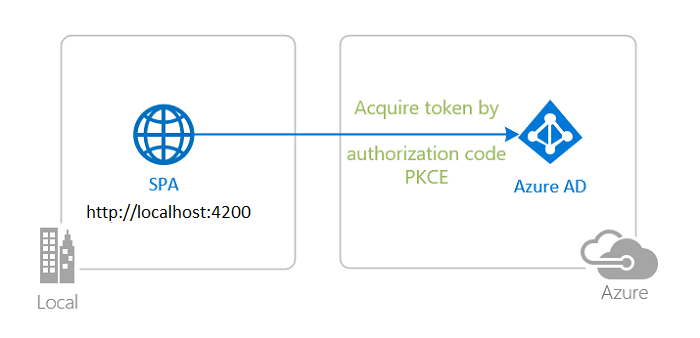

# 3. Implement Azure security (20-25%)
## 3.1 Implement user authentication and authorization
### authenticate and authorize users by using the Microsoft Identity platform + Azure Active Directory
- Goals:
    - sign in users to web applications and provide authorized access to protected web APIs
    - protect a web API by requiring an access token to perform API operations
- Implementations ([MSAL Angular](https://github.com/AzureAD/microsoft-authentication-library-for-js/tree/dev/lib/msal-angular), [sample repo](https://github.com/Azure-Samples/ms-identity-javascript-angular-tutorial)):
    - Sign-in a user to your application (Azure AD)
        - 
        - Azure Portal > Azure AD > App registrations > Register new app > enter name
            - copy application (client) ID
            - copy directory (tenant) ID
        - configuration
            ```js
            const msalConfig = {
            auth: {
                clientId: "<YOUR_CLIENT_ID>",
                authority: "https://login.microsoftonline.com/common", // allows sign-ins with any type of account
                redirectUri: "<YOUR_REDIRECT_URI>",
            },
            ```
        - sign-in
            - login method
            ```js
            export function MSALGuardConfigFactory(): MsalGuardConfiguration {
                return { 
                    interactionType: InteractionType.Redirect,
                };
            }

            export class AppComponent implements OnInit {

                constructor(
                    @Inject(MSAL_GUARD_CONFIG) private msalGuardConfig: MsalGuardConfiguration,
                    private authService: MsalService,
                    private msalBroadcastService: MsalBroadcastService
                ) {}

                ngOnInit(): void {

                login() {
                    if (this.msalGuardConfig.interactionType === InteractionType.Popup) {
                        if (this.msalGuardConfig.authRequest) {
                            this.authService.loginPopup({...this.msalGuardConfig.authRequest} as PopupRequest)
                            .subscribe((response: AuthenticationResult) => {
                                this.authService.instance.setActiveAccount(response.account);
                            });
                            } else {
                            this.authService.loginPopup()
                                .subscribe((response: AuthenticationResult) => {
                                this.authService.instance.setActiveAccount(response.account);
                                });
                        }
                    } else {
                        if (this.msalGuardConfig.authRequest) {
                            this.authService.loginRedirect({...this.msalGuardConfig.authRequest} as RedirectRequest);
                        } else {
                            this.authService.loginRedirect();
                        }
                    }
                }
            }
            ```
            - Single sign-on
            ```js
            export class AppComponent implements OnInit {
                constructor(
                    private authService: MsalService,
                ) {}

                ngOnInit(): void {
                    const silentRequest: SsoSilentRequest = {
                        scopes: ["User.Read"],
                        loginHint: "user@contoso.com"
                    }

                    this.authService.ssoSilent(silentRequest)
                    .subscribe({
                        next: (result: AuthenticationResult) => {
                            console.log("SsoSilent succeeded!");
                        }, 
                        error: (error) => {
                            this.authService.loginRedirect();
                        }
                    });
                }
            }
            ```
            - login event callback
            ```js
            export class HomeComponent implements OnInit {

                private readonly _destroying$ = new Subject<void>();

                constructor(private authService: MsalService, private msalBroadcastService: MsalBroadcastService) { }

                ngOnInit(): void {
                    this.msalBroadcastService.msalSubject$
                    .pipe(
                        filter((msg: EventMessage) => msg.eventType === EventType.LOGIN_SUCCESS),
                        takeUntil(this._destroying$)
                    )
                    .subscribe((result: EventMessage) => {
                        // do something with the result, such as accessing ID token
                    });
                }

                ngOnDestroy(): void {
                    this._destroying$.next(undefined);
                    this._destroying$.complete();
                }
            }
            ```
            - securing routes
            ```js
            const routes: Routes = [
                {
                    path: 'guarded',
                    component: GuardedComponent,
                    canActivate: [ 
                        MsalGuard 
                    ]
                }
            ]
            ```
    - Sign-in a user and get an Access Token for Microsoft Graph to protect resources and scopes
        - [Microsoft Graph API](https://graph.microsoft.com): 
            - offers a single endpoint to provide access to rich, people-centric data and insights in the Microsoft cloud
        - 
        - 
        - Configure API permissions
            - Azure Portal > Azure AD > App registrations > select app > Manage > API permissions
                - Add a permission > Microsoft APIs > **Microsoft Graph**
                    - delegate Permissions > Add permissions
                        - `User.Read`
                - Add a permission > Microsoft APIs > **Azure Service Management**
                    - delegate Permissions > Add permissions
                        - `user_impersonation`
        - Acquire a token
        ```js
        export class AppComponent implements OnInit {
            constructor(
                private authService: MsalService,
            ) {}

            ngOnInit(): void {
                this.authService.acquireTokenSilent({
                    account: this.authService.getActiveAccount(), // get the current user's account
                    scopes: ["User.Read"]  
                }).subscribe({
                    next: (result: AuthenticationResult) => {
                        console.log(result);
                    }, 
                    error: (error) => {
                        this.authService.acquireTokenRedirect({
                            scopes: ["User.Read"]    
                        });
                    }
                });
            }
        }
        ```
        - Working with multiple resources.
        ```js
        // "User.Read" stands as shorthand for "graph.microsoft.com/User.Read"
        const graphToken = await msalInstance.acquireTokenSilent({
            scopes: [ "User.Read" ]
        });
        const customApiToken = await msalInstance.acquireTokenSilent({
            scopes: [ "api://<myCustomApiClientId>/My.Scope" ]
        });

        ```
        - Calling Microsoft Graph API
        ```js
        export class GraphService {
            constructor(private authService: MsalService) { }

            getGraphClient = (providerOptions: ProviderOptions) => {

                /**
                * Pass the instance as authProvider in ClientOptions to instantiate the Client which will create and set the default middleware chain.
                * For more information, visit: https://github.com/microsoftgraph/msgraph-sdk-javascript/blob/dev/docs/CreatingClientInstance.md
                */
                let clientOptions = {
                    authProvider: new MyAuthenticationProvider(providerOptions, this.authService),
                };

                const graphClient = Client.initWithMiddleware(clientOptions);

                return graphClient;
            }
        }
        ```
        ```js
        class MyAuthenticationProvider implements AuthenticationProvider {
            account;
            scopes;
            interactionType;

            constructor(providerOptions: ProviderOptions, private authService: MsalService) {
                this.account = providerOptions.account;
                this.scopes = providerOptions.scopes;
                this.interactionType = providerOptions.interactionType;
            }

            /**
            * This method will get called before every request to the ms graph server
            * This should return a Promise that resolves to an accessToken (in case of success) or rejects with error (in case of failure)
            * Basically this method will contain the implementation for getting and refreshing accessTokens
            */
            getAccessToken(): Promise<string> {
                return new Promise(async (resolve, reject) => {
                    let response: AuthenticationResult;

                    try {
                        response = await this.authService.instance.acquireTokenSilent({
                            account: this.account,
                            scopes: this.scopes
                        });

                        if (response.accessToken) {
                            resolve(response.accessToken);
                        } else {
                            reject(Error('Failed to acquire an access token'));
                        }
                    } catch (error) {
                        // in case if silent token acquisition fails, fallback to an interactive method
                        if (error instanceof InteractionRequiredAuthError) {
                            switch (this.interactionType) {
                                case InteractionType.Popup:
                                    response = await this.authService.instance.acquireTokenPopup({
                                        scopes: this.scopes
                                    });

                                    if (response.accessToken) {
                                        resolve(response.accessToken);
                                    } else {
                                        reject(Error('Failed to acquire an access token'));
                                    }
                                    break;

                                case InteractionType.Redirect:
                                    this.authService.instance.acquireTokenRedirect({
                                        scopes: this.scopes
                                    });
                                    break;

                                default:
                                    break;
                            }
                        }
                    }
                });
            }
        }
        ```
        ```js
        const providerOptions: ProviderOptions = {
            account: this.authService.instance.getActiveAccount()!, 
            scopes: protectedResources.graphMe.scopes, 
            interactionType: InteractionType.Popup
        };
        ```
        ```js
        this.graphService.getGraphClient(providerOptions)
            .api('/me').get()
            .then((profileResponse: ProfileType) => {
                // do something with response
            })
            .catch((error) => {
                // handle errors
            });
        ```
    - Protect an API and call the (ASP.NETCore) API from your client app
        - 
        - Register new API application in Azure (see above)
            - Name: `msal-dotnet-api`
            - Expose the API: Azure Portal > Azure AD > Manage > Expose an API > click "Set"
                - Application ID URI generated, format: `api://{clientId}`
                - Add a scope
                    - Scope name: `access_as_user`
                    - Consent: "Admins and users"
                    - Admin consent display name: "Access msal-dotnet-api"
                    - Admin consent description: "Allows the app to access msal-dotnet-api as the signed-in user."
                    - User consent display name: "Access msal-dotnet-api"
                    - User consent description: "Allow the application to access msal-dotnet-api on your behalf."
                    - State: "Enabled"
                    - click "Add scope"
            - Configure API permissions
                - Azure Portal > Azure AD > App registrations > select **API** app > Manage > Manifest
                    - set `accessTokenAcceptedVersion` to `2`
                    - click "Save"
            - Configure the API app to use the API app registration
                - `API/appsettings.json`
                    - Domain: Azure AD tenant name
                    - ClientId: application ID (clientId) of `msal-dotnet-api`
                    - TenantId : Azure AD tenant ID
                - `API/Controllers/TodoListController.cs`
                    - `scopeRequiredByApi`: exposed API scope: `access_as_user`
        - Register new SPA application in Azure (see above)
            - Set permissions for access to the `msal-dotnet-api` API
                - Azure Portal > Azure AD > App registrations > select **SPA** app > Manage
                    - API permissions > My APIs > select `msal-dotnet-api`
                        - Select permissions
                            - `access_as_user`
                            - click "Add permissions"
                - Configure the SPA app to use the SPA app registration
                    - ClientId: application ID (clientId) of `msal-dotnet-spa`
                    - TenantId : Azure AD tenant ID
                    - Web API scope: `api://{clientId_of_service_app}/access_as_user`
        - Access token validation in API
        ```cs
        public void ConfigureServices(IServiceCollection services)
        {
            // Setting configuration for protected web api
            services.AddAuthentication(JwtBearerDefaults.AuthenticationScheme)
                .AddMicrosoftIdentityWebApi(Configuration);

            // Creating policies that wraps the authorization requirements
            services.AddAuthorization();
        }
        ```
        ```cs
        [Authorize]
        [Route("api/[controller]")]
        [ApiController]
        public class TodoListController : ControllerBase
        {
            // The Web API will only accept tokens 1) for users, and 
            // 2) having the access_as_user scope for this API
            static readonly string[] scopeRequiredByApi = new string[] { "access_as_user" };

            private readonly TodoContext _context;

            public TodoListController(TodoContext context)
            {
                _context = context;
            }

            // GET: api/TodoItems
            [HttpGet]
            public async Task<ActionResult<IEnumerable<TodoItem>>> GetTodoItems()
            {
                HttpContext.VerifyUserHasAnyAcceptedScope(scopeRequiredByApi);
                string owner = User.FindFirst(ClaimTypes.NameIdentifier)?.Value;
                return await _context.TodoItems.Where(item => item.Owner == owner).ToListAsync();
            }
            
            // ...
        }
        ```
        - CORS configuration to be able to call the API (here: allow any)
        ```cs
        services.AddCors(o => o.AddPolicy("default", builder =>
        {
            builder.AllowAnyOrigin()
                   .AllowAnyMethod()
                   .AllowAnyHeader();
        }));
        ```
    - Deploy your applications to Azure
        - 
        - Registration (see above)
            - Register service app (.NETCore web API)
            - Register client app (Angular SPA)
        - Deployment to **Azure App Service** (API)
            - Publish files (VSCode/VS)
                - `dotnet publish --configuration release`
                - published folder: `bin/Release/<FolderName>`
                    - right click: "Deploy to Web App"
                    - "Create New Web App" > Windows
            - Disable Azure App Services default authentication
                - Azure Portal > Azure App Services > select Project > Settings > Authentication/Authorization: set "App Service Authentication" to "Off"
            - Enable CORS
                - Azure Portal > Azure App Services > select Project > API > CORS
                    - check box "Enable Access-Control-Allow-Credentials"
                    - Allowed origins: add URI of published website
        - Deployment to **Azure Storage** (SPA)
            - Create an Azure Storage blob and obtain website URI
            - Build your project and upload it to Azure Storage blob
                - `ng build --prod`
            - Update config files with website callback URI
    - Control access to your protected API using App Roles and Security Groups
        - App Roles
        - Security Groups
    - Develop and provision a multi-tenant SaaS application
    - Advanced scenarios

### create and implement shared access signatures

## 3.2 Implement secure cloud solutions
### secure app configuration data by using App Configuration Azure Key Vault

### develop code that uses keys, secrets, and certificates stored in Azure Key Vault

### implement solutions that interact with Microsoft Graph
