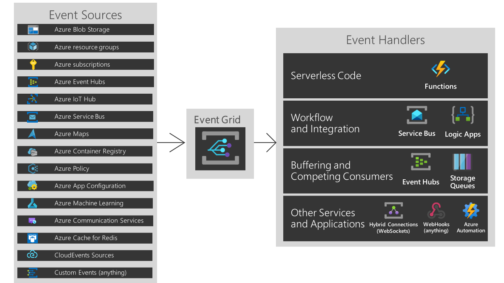
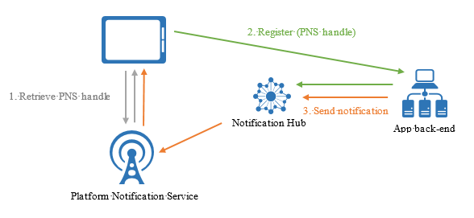
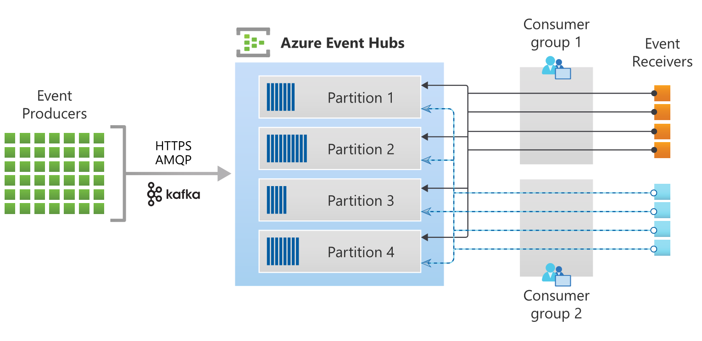
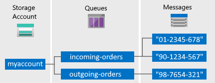

# 5. Connect to and consume Azure services and third-party services (15-20%)
## 5.1 Implement API Management
- **Backend API** - An HTTP service that implements your API and its operations. For more information, see Backends.
- **Frontend API/APIM API** - An APIM API does not host APIs, it creates façades for your APIs. You customize the façade according to your needs without touching the backend API. For more information, see Import and publish an API.
- **APIM product** - a product contains one or more APIs as well as a usage quota and the terms of use. You can include a number of APIs and offer them to developers through the Developer portal. For more information, see Create and publish a product.
- **APIM API operation** - Each APIM API represents a set of operations available to developers. Each APIM API contains a reference to the backend service that implements the API, and its operations map to the operations implemented by the backend service. For more information, see Mock API responses.
- **Version** - Sometimes you want to publish new or different API features to some users, while others want to stick with the API that currently works for them
    - Versions allow you to present groups of related APIs to your developers. Versions differentiate themselves through a version number (which is a string of any value you choose), and a versioning scheme (path, query string or header)
    - Breaking changes
- **Revision** - When your API is ready to go and starts to be used by developers, you usually need to take care in making changes to that API and at the same time not to disrupt callers of your API. It's also useful to let developers know about the changes you made.
    - Revisions allow you to make changes to your APIs in a controlled and safe way. When you want to make changes, create a new revision. You can then edit and test API without disturbing your API consumers. When you are ready, you can then make your revision current – at the same time, you can post an entry to the new change log, to keep your API consumers up to date with what has changed.
    - Each version can have multiple revisions, just like a non-versioned API. Should you find that your revision has breaking changes, or if you wish to formally turn your revision into a beta/test version, you can select ‘Create Version from Revision’ on the revision context menu on the Revisions tab.
- **Developer portal** - Your customers (developers) should use the Developer portal to access your APIs. The Developer portal can be customized. For more information, see Customize the Developer portal.
### create an APIM instance
```ps
New-AzApiManagement -Name "myapim" -ResourceGroupName "myResourceGroup" `
  -Location "West US" -Organization "Contoso" -AdminEmail "admin@contoso.com"
```
### configure authentication for APIs
[docs](https://docs.microsoft.com/en-us/azure/api-management/api-management-howto-protect-backend-with-aad)

### define policies for APIs
[docs](https://docs.microsoft.com/en-us/azure/api-management/set-edit-policies)

### import OpenAPI definitions
[docs](https://docs.microsoft.com/en-us/azure/api-management/import-api-from-oas)


## 5.2 Develop event-based solutions
### implement solutions that use Azure Event Grid


- **Events** - What happened.
- **Event sources** - Where the event took place.
- **Topics** - The endpoint where publishers send events.
- **Event subscriptions** - The endpoint or built-in mechanism to route events, sometimes to more than one handler. Subscriptions are also used by handlers to intelligently filter incoming events.
- **Event handlers** - The app or service reacting to the event.

Use cases:
- Email when VM changes
- Resize uploaded images
- Trigger Automation runbook
- Email when IoT Hub device disconnects
- Stream data from Event Hubs
- Route Media Services events
- Route to Hybrid Connection
- Handle Service Bus events

### implement solutions that use Azure Notification Hubs


### implement solutions that use Azure Event Hub
- Big data streaming platform and event ingestion service




## 5.3 Develop message-based solutions
### implement solutions that use Azure Service Bus
- Azure Service Bus: fully managed enterprise message broker with message queues and publish-subscribe topics
    - used to decouple applications and services from each other
- Benefits:
    - Load-balancing work across competing workers
    - Safely routing and transferring data and control across service and application boundaries
    - Coordinating transactional work that requires a high-degree of reliability
- Messaging scenarios
    - **Messaging**: Transfer business data, such as sales or purchase orders, journals, or inventory movements.
    - **Decouple applications**: Improve reliability and scalability of applications and services. Producer and consumer don't have to be online or readily available at the same time. The load is leveled such that traffic spikes don't overtax a service.
    - **Load Balancing**: Allow for multiple competing consumers to read from a queue at the same time, each safely obtaining exclusive ownership to specific messages.
    - **Topics and subscriptions**: Enable 1:n relationships between publishers and subscribers, allowing subscribers to select particular messages from a published message stream.
    - **Transactions**: Allows you to do several operations, all in the scope of an atomic transaction. For example, the following operations can be done in the scope of a transaction.
        1. Obtain a message from one queue
        2. Post results of processing to one or more different queues.
        3. Move the input message from the original queue.
        - The results become visible to downstream consumers only upon success, including the successful settlement of input message, allowing for once-only processing semantics. This transaction model is a robust foundation for the compensating transactions pattern in the greater solution context.
    - **Message sessions**: Implement high-scale coordination of workflows and multiplexed transfers that require strict message ordering or message deferral.
- Terminology
    - **Queues**: Messages are sent to and received from queues. Queues store messages until the receiving application is available to receive and process them.
        - 
    - **Topics**: You can also use topics to send and receive messages. While a queue is often used for point-to-point communication, topics are useful in publish/subscribe scenarios.
        - 
    - **Namespaces**: container for all messaging components (queues and topics). Multiple queues and topics can be in a single namespace, and namespaces often serve as application containers
### implement solutions that use Azure Queue Storage queues

- Create an Azure storage account
- Set up your development environment
    - Create a Windows console application project
    - Use NuGet to install the required packages
        - `Azure.Storage.Queues`
        - `System.Configuration.ConfigurationManager`
- Get your storage connection string
    - Copy your credentials from the Azure portal
    ```xml
    <configuration>
        <startup>
            <supportedRuntime version="v4.0" sku=".NETFramework,Version=v4.7.2" />
        </startup>
        <appSettings>
            <add key="StorageConnectionString" value="connection-string" />
        </appSettings>
    </configuration>
    ```
- Create the Queue Storage client
    ```cs
    //-------------------------------------------------
    // Create the queue service client
    //-------------------------------------------------
    public void CreateQueueClient(string queueName)
    {
        // Get the connection string from app settings
        string connectionString = ConfigurationManager.AppSettings["StorageConnectionString"];

        // Instantiate a QueueClient which will be used to create and manipulate the queue
        QueueClient queueClient = new QueueClient(connectionString, queueName);
    }
    ```
- Create a queue
    ```cs
    //-------------------------------------------------
    // Create a message queue
    //-------------------------------------------------
    public bool CreateQueue(string queueName)
    {
        try
        {
            // Get the connection string from app settings
            string connectionString = ConfigurationManager.AppSettings["StorageConnectionString"];

            // Instantiate a QueueClient which will be used to create and manipulate the queue
            QueueClient queueClient = new QueueClient(connectionString, queueName);

            // Create the queue
            queueClient.CreateIfNotExists();

            if (queueClient.Exists())
            {
                Console.WriteLine($"Queue created: '{queueClient.Name}'");
                return true;
            }
            else
            {
                Console.WriteLine($"Make sure the Azurite storage emulator running and try again.");
                return false;
            }
        }
        catch (Exception ex)
        {
            Console.WriteLine($"Exception: {ex.Message}\n\n");
            Console.WriteLine($"Make sure the Azurite storage emulator running and try again.");
            return false;
        }
    }
    ```
- Insert a message into a queue
    ```cs
    //-------------------------------------------------
    // Insert a message into a queue
    //-------------------------------------------------
    public void InsertMessage(string queueName, string message)
    {
        // Get the connection string from app settings
        string connectionString = ConfigurationManager.AppSettings["StorageConnectionString"];

        // Instantiate a QueueClient which will be used to create and manipulate the queue
        QueueClient queueClient = new QueueClient(connectionString, queueName);

        // Create the queue if it doesn't already exist
        queueClient.CreateIfNotExists();

        if (queueClient.Exists())
        {
            // Send a message to the queue
            queueClient.SendMessage(message);
        }

        Console.WriteLine($"Inserted: {message}");
    }
    ```
