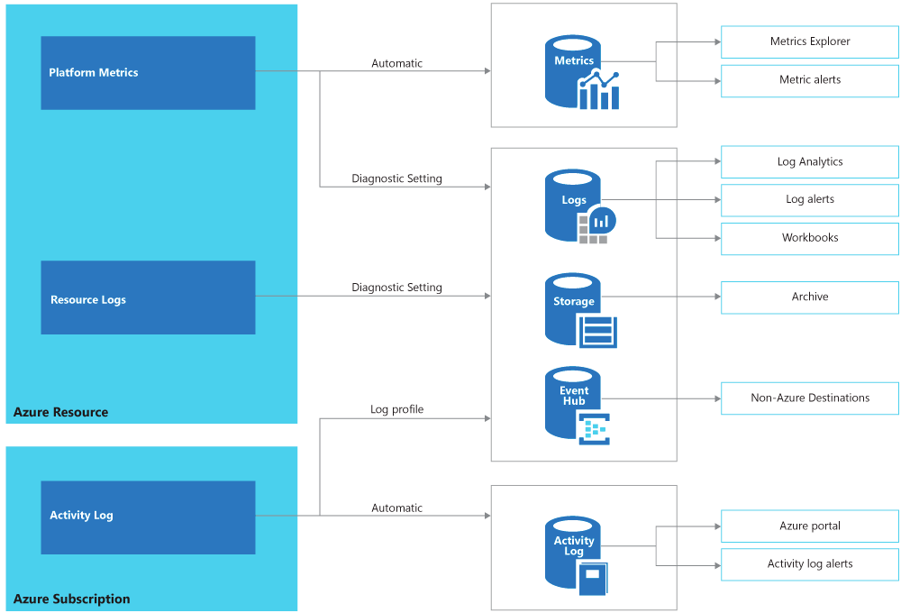

# 1. Design Monitoring (10-15%)
## 1.1 Design for cost optimization
### recommend a solution for cost management and cost reporting

### recommend solutions to minimize costs

## 1.2 Design a solution for logging and monitoring
### determine levels and storage locations for logs

- **Platform metrics**: numerical values, automatically collected
    - describe some aspect of a resource at a particular time
- **Resource logs**: data plane
    - provide insight into operations that were performed within an Azure resource
- **Activity log**: management plane
    - provides insight into the operations on each Azure resource in the subscription from the outside

### plan for integration with monitoring tools including Azure Monitor and Azure Sentinel
- Azure Monitor
- Azure Sentinel

### recommend appropriate monitoring tool(s) for a solution
- Azure Activity Log
    - allows you to monitor operations on resources in a subscription
    - can be queried and reviewed in a Log Analytics Workspace (use AzureActivity)
- Azure Sentinel
    - assists with alert detection, threat visibility, proactive hunting, and threat response automatically
    - works with multiple tenants and there are currently more than 40 connectors for other systems available (3rd party providers)
    - allows monitoring Azure and on-premises services
    - aggregates and analyzes metrics, logs, and traces
- Application Insights
    - allows you to gather the application information from inside apps regardless of where they are running and to analyze internal bottlenecks.

### choose a mechanism for event routing and escalation
### recommend a logging solution for compliance requirements
- Azure Policy