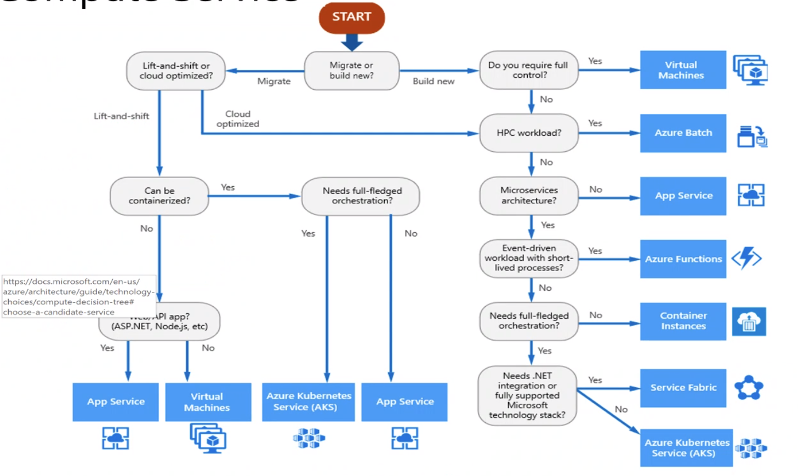
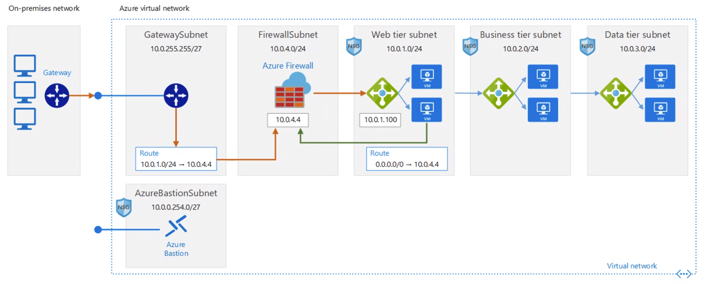
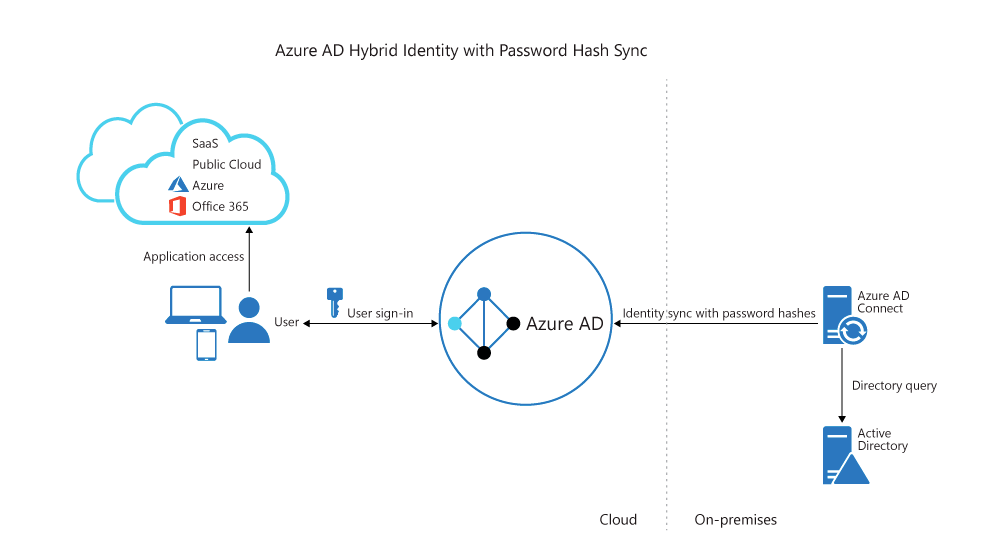
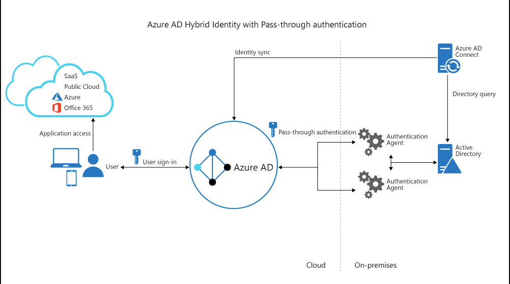
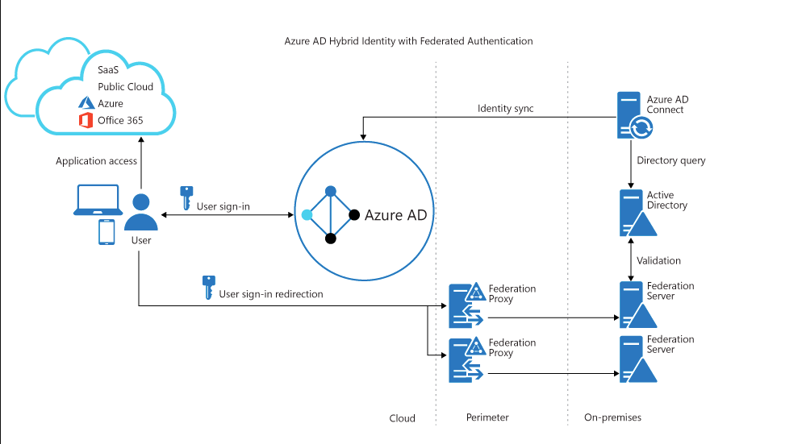
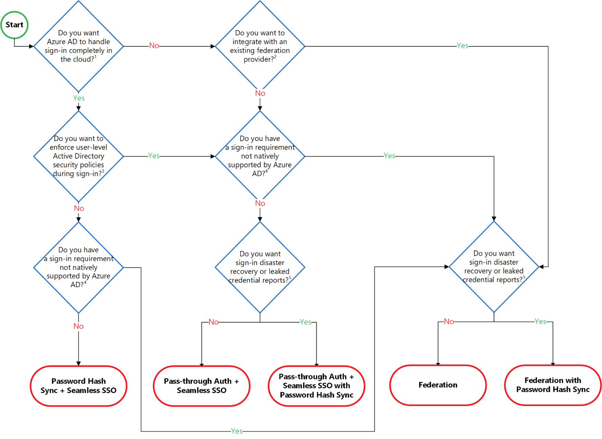
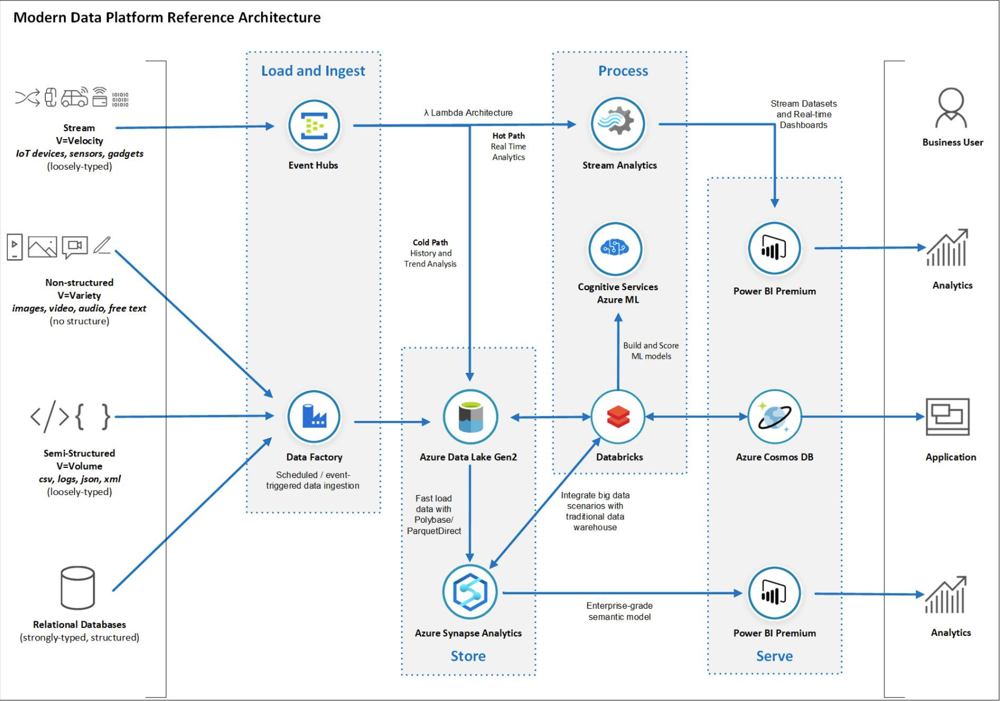

# Notes
## M1. Design Azure compute services

- https://docs.microsoft.com/en-us/azure/cloud-adoption-framework/ready/enterprise-scale/architecture
- managed services less expensive than unmanaged services
- IaaS vs PaaS: shared responsibility
    - https://docs.microsoft.com/en-us/azure/security/fundamentals/shared-responsibility
- Azure well-architected framework pillars
    - cost optimization
    - operational excellence
    - permorance efficiency
    - reliability
    - security
- To avoid hard limits in subscriptions, you can create multiple subscriptions
- Service level agreements: listen to the business requirements and see what SLA is necessary
    - https://docs.microsoft.com/en-us/azure/architecture/framework/resiliency/business-metrics#understand-service-level-agreements
- https://azurecharts.com/
- Azure Resource Explorer
    - browse all resources, see ARM JSON files

## M2. Design Azure Networking
- communication between VNETs (different locations/tenants/subscriptions)
    1. **peering**
        - fast deployment
        - not expensive
        - private
    2. VNET-TO-VNET
        - encrypted (IPsec VPN)
        - slow deployment
        - expensive
- protect traffic between 2 subnets of 2 VNETs
    - **Network Security groups** (NSG): 
        - firewall that you can attach to a NIC (public/private IP) or a subnet
            - VM: control traffic in/out Linux (iptables) and Windows (Windows Firewall) machines
                - OS level firewall
            - subnet: control traffic between VMs on the subnet
        - https://docs.microsoft.com/en-us/azure/virtual-network/virtual-networks-faq#what-are-the-constraints-related-to-global-vnet-peering-and-load-balancers
- planning for virtual networks
    - criteria
        - latency (based on geolocation)
        - availability 
        - price
        - laws (GDPR)
    - address space, subnets, regions, subscription
        - VNET is scoped to a single region/location (use VNET peering)
    - UDR: User-defined route, managed by Azure
    - Azure Policy
        - apply policy on subscriptions, all users that use subscription are impacted
    - Azure DNS
        - set custom DNS rules
        - https://docs.microsoft.com/en-us/azure/active-directory-domain-services/manage-dns
    - Azure Load Balancer vs. Azure Application Gateway
        - Azure Load Balancer: L2 & L3 -> uses NSGs
            - used internally attched to NICs or subnets
        - Azure Application Gateway (HTTP): L7 -> uses WAF (Web Application Gateway)
            - sits in between public internet and private VMs, this way VMs are not exposed directly
- LoadBalancer, 4 services: https://docs.microsoft.com/en-us/azure/architecture/guide/technology-choices/load-balancing-overview
    1. DNS resolution: Azure Traffic Manager. 
    2. Azure Load Balancer (layer 3). 
    3. Azure FrontDoor (same than Application Gateway but global reach). 
    4. Application Gateway (layer 7).
    
- Network integration
    - Azure ExpressRoute: https://azure.microsoft.com/en-us/pricing/details/expressroute/
- Bastion
    - 
    - https://azure.microsoft.com/en-us/pricing/details/azure-bastion/
        - €120/month

## M3. Design for Migration
- Migration Journey
- Azure Migrate
- Lab 1: Migrating Hyper-V VMs to Azure by using Azure Migrate
    - Register VMs using Azure Migrate
    - All VMs will be replicated to Azure (with resource targets) using ASR: Asynchronous Replication
        - initially: full VM replicated (OS + data disks)
        - uses change bits to sync changes only until the migrate is done (no data loss)
    - Using Traffic Manager (TM) you can redirect existing routes to Azure
        - uses health checks on both on-premise and new Azure resources and checks when resources are in ready state in order to redirect traffic
    - Recovery Services Vault
        - Recovery Plan: automate the migration project (using Failover functionallity: switch everything from on-premises to cloud)
            - using "Runbooks" (scripts)
    - Afterwards: do disk encryption
- Migrating databases
    - Strategies
        - offline migration: requires shutting down the server at the start of the migration
        - online migration: uses continuous sync of live data
    - Database Migration Assistant: create script & deploy schema
    - Database Migration Service: runs migration scripts in the cloud (set source & destination), uses Cloud compute power
- Migrating data to Azure Storage
    - AzCopy tool
- Azure Data Box: physical box with data drives you can ship to Microsoft

## M4. Design Authentication and Authorization
- Azure Active Directory
    - tenant: `<companyname>.onmicrosoft.com`
        - users
            - guest: other tenant
            - member
        - groups
- Active Directory
    - domain controllers
        - user
        - group
        - computer
- Sync AD with AAD: install **Azure Active Directory Connect** on VM in Active Directory on-premise
    - syncs users/groups to Azure Active Directory
- SAML: authentication identity provider
- Sign-in methods
    1. PHS: Password Hash Synchronization
        - Local password hash is synchronized with Azure AD
        - Authenticate with local DC, send password hash to Azure AD, authenticate in Azure AD tenant
        - 
    2. PTA: Pass-Through Authentication
        - uses on-premise AAD proxy to securely authenticate with Azure AD (using ExpressRoute or VPN)
        - password hash not stored in Azure AD
        - 
    3. ADFS (role)
        - requires 2 ADFS servers + 2 WAP servers
        - 
- Authentication decision tree
    - 
- https://docs.microsoft.com/en-us/azure/architecture/reference-architectures/identity/azure-ad
- https://docs.microsoft.com/en-us/azure/active-directory/hybrid/plan-connect-topologies

## M5. Design Governance
- Azure Policy
- Azure Blueprint

## M6. Design a Solution for Databases
- Data Platforms
    - Relational Database Management Systems
    - Key/Value Stores
    - Document Databases
    - Graph Databases
- Azure Data Storage
    - Azure SQL Database
    - Azure Cosmos DB
    - Azure Blob Storage
    - Azure Data Lake Storage
    - Comparison - Azure Data Lake Store and Azure Blob Storage Containers
    - Azure Files
    - Azure Queue
    - Disk Storage
- Data encryption

## M7. Select an Appropriate Storage Account
- Azure Blob Storage Access Tiers

## M8. Design Data Integration
- Architecture
    
    - https://docs.microsoft.com/en-us/azure/architecture/
- Azure Data Factory
    - code-free ETL as a Serice using "Data Flows"

## M9. Design a Solution for Logging and Monitoring
- Application Insights
- Container Insights
- Network Watcher
- Azure Monitor
    - metrics
    - logs
    - diagnostic settings: send logs/metric to other monitoring services
- Log Analytics Workspace
