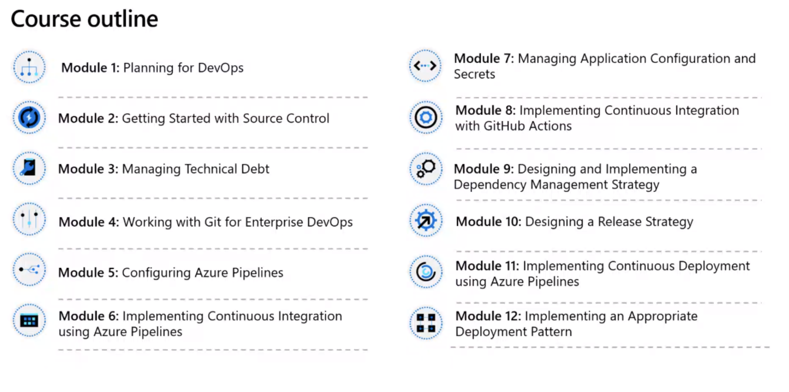
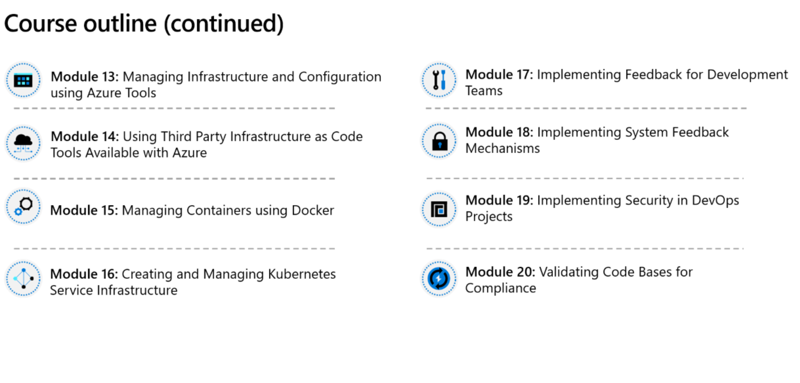
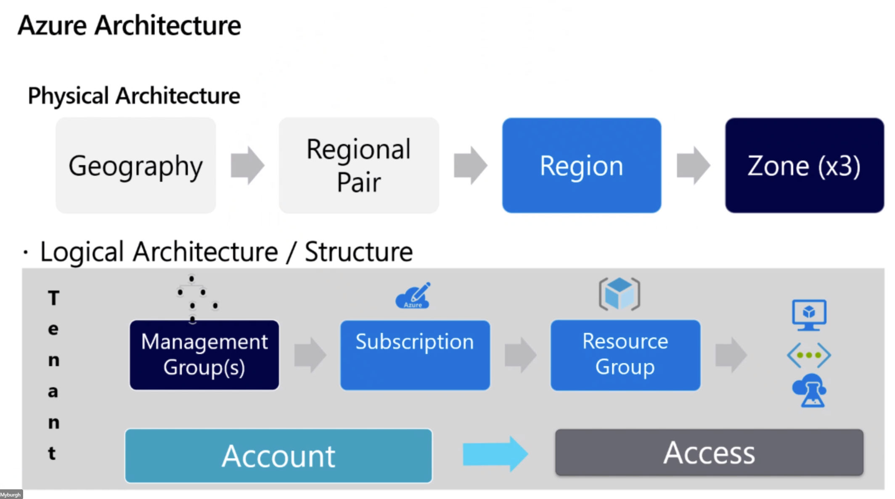
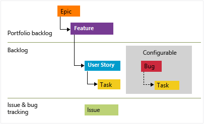

# AZ-400: Designing and Implementing Microsoft DevOps Solutions

- Lab environment: https://esi.learnondemand.net/
- Assignments: https://github.com/MicrosoftLearning/AZ400-DesigningandImplementingMicrosoftDevOpsSolutions

- Azure DevOps organization: https://dev.azure.com/az400-sandbox/
    - Demo generator: https://azuredevopsdemogenerator.azurewebsites.net/

# Day 1
## M0: Introduction

## M1: Planning for DevOps
- Azure Boards: Agile process

## M2: Getting Started with Source Control
## M4: Working with Git for Enterprise DevOps
- [x] lab 1
- [x] lab 3
- [ ] lab 2
- [ ] lab 4

# Day 2
## M3: Managing Technical Dept
## M5: Configuring Azure Pipelines
## M6: Implementing Continuous Integration Using Azure Pipelines
## M10: Designing a Release Strategy
- [x] lab 5
- [x] lab 6a
- [x] lab 6b
- [ ] lab 10a
- [ ] lab 10b

# Day 3
## M12: Implementing an Appropriate Deployment Pattern
## M7: Managing Application Configuration and Secrets
## M9: Designing and Implementing a Dependency Management Strategy
- [ ] lab 12
- [ ] lab 7
- [ ] lab 9

# Day 4
## M8: Implementing Continuous Integration with Github Actions
## M13: Managing Infrastructure and Configuration using Azure Tools
## M14: Using Third Party IaC Tools Available with Azure
## M15: Managing Containers using Docker
## M16: Creating and Managing Kubernetes Service Infrastructure