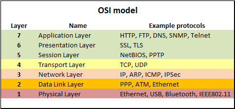

# 2. Cloud Azure Services (15-20%)
## 2.1 Core Azure Services
### Regions and Region Pairs, Availability Zones
- **Azure Regions**: geographical area on the planet that contains 1+ datacenters that are networked together with a low-latency network
    - Azure assigns/controls the resources within each region to ensure workloads are balanced
    - some services or VM features are only available in certain regions
- **Azure Availability Zones**: physically separate datacenters within an Azure region made up of one or more datacenters equipped with independent power, cooling, and networking
    - isolation boundary to ensure high availability
    - availability zones are connected through high-speed, private fiber-optic networks
    - usage
        - **zonal services**: pin resource to specific zone (VMs, managed disks, IP addresses)
        - **zone-redundant services**: platform replicates automatically across zones (zone-redundant storage, SQL database)
    - 
- **Azure Region Pair**: each region is paired with another region within the same geography (such as US, Europe, or Asia)
    -  allows for the replication of resources across a geography that helps reduce the likelihood of interruptions because of events such as natural disasters, civil unrest, power outages, or physical network outages
        - example: US west + US east region pair
    - 

### Subscriptions, Management Groups, Resource Groups, Resources
- Azure account **scope** levels: top-down hierarchy of an organization structure in Azure
    - **Resources**: instances of services (VMs, storage, DBs)
    - **Resource groups**: logical containers for combined resources
    - **Subscriptions**: groups together user accounts and resources that have been created by those user accounts
        - 
        - **billing boundary**: set limits/quotas on resources
            - 
        - **access control boundary**: access-management policies at the subscription level
            - create separate subscriptions to reflect different organizational structures:
                - environments: development, testing, security, ...
                - organizational structures: different teams, departments, projects, ...
                - billing: costs are aggregated at subscription level
                - subscription limits: in case the max number of Azure resources within subscription is exceeded
- **Management groups**: manage access/policy/compliance for multiple subscriptions
    - 
 
### Azure Resource Manager
- **Azure Resource Manager**: deployment and management service for Azure
    - manage infrastructure through declarative templates rather than scripts
        - **ARM templates**: JSON file that defines what you want to deploy to Azure
    - deploy/manage/monitor all resources as a group, rather than handling these resources individually
    - redeploy solutions throughout the development life cycle in a **consistent state**
    - define **dependencies** between resources to deploy in the correct order
    - apply access control to all services using **RBAC**
    - apply **tags** to resources to logically organize resources within subscriptions
        - view costs for a group of resources that share the same tag

## 2.2 Core resources available in Azure
### Compute
- **Azure Virtual Machines**: create and use VMs in the cloud
    - **IaaS**: total control over an operating system and environment
        - ability to run custom software
        - use custom hosting configurations
    - **Virtual machine scale sets**: use to deploy and manage a set of identical VMs
        - supports autoscale
    - **Azure Batch**: enables large-scale parallel and high-performance computing (HPC) batch jobs with the ability to scale to 1000+ VMs
- **Azure App Services**: quickly build, deploy, and scale enterprise-grade web, mobile, and API apps running on any platform
    - **WebJobs**: used to run background tasks as part of your application logic
    - deployment and management are integrated into the platform
    - endpoints can be secured
    - sites can be scaled quickly to handle high traffic loads
    - built-in load balancing and traffic manager provide high availability
- **Azure Container Instances** (ACI): run multiple instances of a containerized application on a single host machine
    - **PaaS**: allows you to upload your containers, which it runs for you
    - **Containers**: lightweight, virtualized application environments
- **Azure Kubernetes Service** (AKS): used to deploy solutions using a **microservice architecture**
    - complete orchestration (automating, managing, and interacting with a large number of containers) service for containers with distributed architectures
    - scale the back end separately to improve performance
    - decide to use a different storage service
    - replace the storage container without affecting the rest of the application
- **Azure Functions**: commonly used when you need to perform work in response to an event
    - Abstraction of servers
    - Event-driven scale
    - Micro-billing
- **Azure Logic Apps**: web-based designer and can execute logic triggered by Azure services without writing any code
- **Windows Virtual Desktop**: desktop and application virtualization service that runs on the cloud
    - enables your users to use a cloud-hosted version of Windows from any location

### Networking
- **Virtual Networks**
    - Isolation and segmentation
    - Internet communications
    - Communicate between Azure resources
        - Virtual networks
        - Service endpoints
    - Communicate with on-premises resources
        - **Point-to-site virtual private networks**: connection from a computer outside your organization, back into your corporate network
        - **Site-to-site virtual private networks**: links your on-premises VPN device or gateway to the Azure VPN gateway in a virtual network
        - **Azure ExpressRoute**:  private connection from your on-premises infrastructure to your Azure infrastructure with greater bandwidth, redundancy and higher levels of security
            - Not encrypted: data doesn't travel over the public internet, so it's not exposed to the potential risks associated with internet communications
            - L3 connectivity
            - Built-in redundancy
            - Connectivity to Microsoft services
            - Across on-premises connectivity with ExpressRoute Global Reach
            - Dynamic Routing
            - ExpressRoute connectivity models
                - **CloudExchange colocation**: Colocated providers offer both L2 and L3 connections between your infrastructure, which might be located in the colocation facility, and the Microsoft cloud
                - **Point-to-point Ethernet connection**: L2 and L3 connectivity between your on-premises site and Azure
                - **Any-to-any connection**: integrate your WAN with Azure by providing connections to your offices and datacenters, all WAN providers offer L3 connectivity
            - Info: OSI model layers
                - 
    - Route network traffic
        - Routing tables
        - Border Gateway Protocol (BGP) for routing between autonomous systems (AS)
    - Filter network traffic
        - **Network security groups** (NSG): Azure resource that can contain multiple inbound and outbound security rules
        - Network virtual appliances: specialized VM that can be compared to a hardened network appliance (running a firewall or performing WAN optimization)
    - Connect virtual networks
        - **Virtual network peering**: enables resources in each virtual network to communicate with each other
            - virtual networks can be in separate regions, which allows you to create a global interconnected network through Azure
        - **User-Defined Routing** (UDR): allows network admins to control the routing tables between subnets within a VNet, as well as between VNets
            - allows greater control over network traffic flow
        - 
- **VPN Gateway**
    - Connect on-premises datacenters to virtual networks through a **site-to-site** connection
        - 
        - **policy-based**: specify statically the IP address of packets that should be encrypted through each tunnel
        - **route-based**: IPSec tunnels are modeled as a network interface or virtual tunnel interface
            - IP routing (static/dynamic routes/routing protocols) decides which one of these tunnel interfaces to use when sending each packet
    - Connect individual devices to virtual networks through a **point-to-site** connection
    - Connect virtual networks to other virtual networks through a **network-to-network** connection
    - Deployment resource requirements:
        - 
    - High-availability strategies
        - **Active/standby configuration**: when planned maintenance or unplanned disruption affects the active instance, the standby instance automatically assumes responsibility for connections without any user intervention
            - 
        - **Active/active configuration**: assign a unique public IP address to each instance, create separate tunnels from the on-premises device to each IP address
            - 

### Storage
- **Storage Accounts**: provides a unique namespace for your Azure Storage data, that's accessible from anywhere in the world over HTTP or HTTPS
    - data in this account is secure, highly available, durable and scalable
    - **Container (Blob) Storage**: object storage solution for the cloud, store massive amounts of data, such as text or binary data
        - use cases
            - Serving images or documents directly to a browser
            - Storing files for distributed access
            - Streaming video and audio
            - Storing data for backup and restore, disaster recovery, and archiving
            - Storing data for analysis by an on-premises or Azure-hosted service
            - Storing up to 8 TB of data for virtual machines
    - 
    - Access tiers
        - **Hot access tier**: optimized for storing data that is accessed frequently (for example, images for your website)
        - **Cool access tier**: optimized for data that is infrequently accessed and stored for 30+
        - **Archive access tier**: appropriate for data that is rarely accessed and stored for 180+, with flexible latency requirements
- **Disk Storage**: provides disks for Azure virtual machines
    - allows data to be persistently stored and accessed from an attached virtual hard disk
- **File Storage**: fully managed file shares in the cloud that are accessible via the industry standard Server Message Block and Network File System
    - can be mounted concurrently by cloud or on-premises deployments of Windows, Linux, and macOS
    - applications running in Azure virtual machines or cloud services can mount a file storage share to access file data (~SMB)
    - you can access the files from anywhere in the world, by using a URL that points to the file
        - **Shared Access Signature** (SAS) tokens allow access to a private asset for a specific amount of time

### Database
- **Cosmos DB**: globally distributed, multi-model database service
    - elastically and independently scale throughput and storage across any number of Azure regions worldwide
    - take advantage of fast, single-digit-millisecond data access by using any one of several popular APIs
    - provides comprehensive service level agreements for throughput, latency, availability, and consistency guarantees
    - supports **schema-less data**
- **Azure SQL Database**: relational database based on the latest stable version of the Microsoft SQL Server database engine
    - PaaS database engine
    - fully managed service that has built-in high availability, backups, and other common maintenance operations
    - handles most of the database management functions, such as upgrading, patching, backups, and monitoring, without user involvement
    - enables you to process **both relational data and non-relational structures**
        - graphs, JSON, spatial, and XML
    - advanced query processing features
        - high-performance, in-memory technologies and intelligent query processing
- **Azure Database for MySQL**: relational database service based on the MySQL Community Edition database engine
    - built-in high availability with no additional cost
    - predictable performance and inclusive, pay-as-you-go pricing
    - scale as needed, within seconds
    - ability to protect sensitive data at-rest and in-motion
    - automatic backups
    - enterprise-grade security and compliance
- **Azure Database for PostgreSQL**:  relational database service based on the community version of the open-source PostgreSQL database engine
    - Deployment options
        - Single server 
        - Hyperscale (Citus)
            - supports multi-tenant applications
            - queries across multiple machines by using sharding
- **SQL Managed Instance**: scalable cloud data service that provides the broadest SQL Server database engine compatibility with all the benefits of a fully managed platform as a service

### Analytics
- **Azure Synapse Analytics**: limitless analytics service that brings together enterprise data warehousing and big data analytics
    - query data on your terms by using either serverless or provisioned resources at scale
    - unified experience to ingest, prepare, manage, and serve data for immediate BI and machine learning needs
- **Azure HDInsight**: fully managed, open-source analytics service for enterprises
    - run popular open-source frameworks and create cluster types such as Apache Spark, Apache Hadoop, Apache Kafka, Apache HBase, Apache Storm, and Machine Learning Services
    - supports a broad range of scenarios such as extraction, transformation, and loading (ETL), data warehousing
- **Azure Databricks**: unlock insights from all your data and build artificial intelligence solutions
    - set up Apache Spark environment, autoscale and collaborate on shared projects in an interactive workspace
    - supports Python, Scala, R, Java, and SQL
    - supports data science frameworks/libraries: TensorFlow, PyTorch, and scikit-learn
- **Azure Data Lake Analytics**: on-demand analytics job service that simplifies big data
    - handle jobs of any scale instantly by setting the dial for how much power you need
    - pay for your job when it's running, making it more cost-effective

### Azure Marketplace
