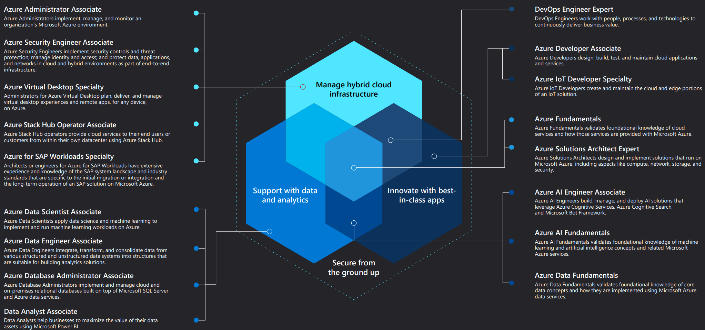

# Azure Certification Training

Notes and learning resources collected during my training to become a certified DevOps Engineer Expert.

## Training Path
1. ### [AZ-900: Microsoft Azure Fundamentals](AZ-900)
2. ### AZ-204: Microsoft Azure Developer
3. ### AZ-104: Microsoft Azure Administrator
4. ### AZ-400: Designing and Implementing Microsoft DevOps Solutions
5. ### AZ-303: Microsoft Azure Architect Technologies
6. ### AZ-304: Microsoft Azure Architect Design

## Learning Resources
- [Microsoft Learn: Azure Fundamentals - Learning Path: part 1-6](https://docs.microsoft.com/en-us/learn/certifications/azure-fundamentals/)

## Azure Certifications Overview
